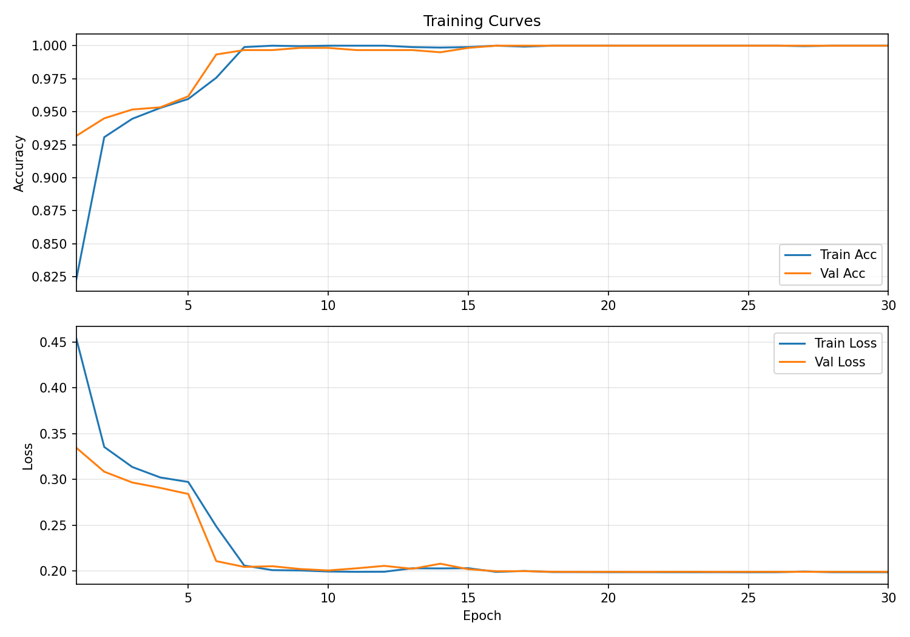

# 🛰️ AOI Downloader & Ship Detection — Real-ESRGAN ×4 + ConvNeXt

An interactive **Streamlit GUI** for selecting an **Area of Interest (AOI)** on a world map, downloading high-resolution map tiles, optionally **upscaling with Real-ESRGAN ×4**, and performing **ship detection** using a **ConvNeXt** model.  
Designed for convenient visual analysis and dataset preparation.

---

## 📑 Table of Contents
1. [Overview](#-overview)
2. [Features](#-features)
3. [Repository Structure](#-repository-structure)
4. [Installation](#-installation)
5. [Usage](#-usage)
6. [Output Directories](#-output-directories)
7. [Model Details](#-model-details)
8. [Model Training](#-model-training)
9. [ConvNeXt Architecture](#-convnext-architecture)
10. [Real-ESRGAN Integration](#-real-esrgan-integration)
11. [Configuration Reference](#-configuration-reference)
12. [Example Commands](#-example-commands)

---

## 🚀 Overview

This application lets you:

1. Draw an AOI directly on a map (EOX Sentinel-2, Esri, or OSM).  
2. Download and stitch XYZ tiles into a single image.  
3. Optionally run **Real-ESRGAN ×4** super-resolution.  
4. Run **ConvNeXt-based ship detection** on either the RAW or UPSCALED image.  
5. Display both images side-by-side and download the results.

The UI is compact:  
**Left:** interactive map  
**Right:** progress panel  
**Below:** side-by-side input and detection images (no scrolling needed)

---

## ✨ Features

- 🗺️ Draw AOIs directly on interactive map layers  
- 🧩 Automatic tile download and stitching  
- 🔼 Optional Real-ESRGAN ×4 super-resolution  
- 🚢 ConvNeXt-based ship detection  
- ⚙️ Adjustable stride and probability threshold  
- 💾 Organized output folders (`downloads/`, `results/`)


---

## 📁 Repository Structure

```
repo_root/
├── application/
│   ├── gui_app.py                 # Main GUI entrypoint
│   ├── ConvNextInference.py       # Ship detection logic (detect_and_draw)
│   ├── providers.py               # Map tile providers (EOX, Esri, OSM)
│   ├── tiling.py                  # AOIRequest, TileStitcher, save_output_image
│   └── RRDBNet.py                 # Real-ESRGAN (RRDBNet) wrapper
│
├── training/
│   ├── convnext_train.py          # Training script (provided above)
│   ├── convnext_base_config.json  # Training config (dataset path, epochs, etc.)
│   └── pretrained/
│       ├── convnext_ships.pt      # Trained ConvNeXt checkpoint
│       └── training_curves.png    # Accuracy/Loss curves
│
├── scripts/
│   ├── create_venv.sh             # Linux/macOS venv setup
│   └── create_venv.bat            # Windows venv setup
│
├── downloads/                     # Runtime output (raw/upscaled)
├── results/                       # Detection overlays (raw/upscaled)
└── README.md
```

---

## 🧩 Installation

> Requires **Python 3.12+** and an internet connection for wheel downloads.

**Windows (Cmd):**
```
cd scripts
create_venv.bat
call venv\Scripts\activate.bat
```

**Linux / macOS (Bash):**
```
cd scripts
chmod +x create_venv.sh
./create_venv.sh
source venv/bin/activate
```

By default this installs:
- PyTorch 2.7.0 + CUDA 12.8 (auto-fallback to CPU wheels)
- Streamlit / Folium / Real-ESRGAN / OpenCV / TQDM / Matplotlib

| Variable | Default | Description |
|-----------|----------|-------------|
| `CUDA_WHL_TAG` | `cu128` | PyTorch CUDA wheel tag |
| `PYTORCH_VER` | `2.7.0` | PyTorch version |
| `VENV_DIR` | `venv` | Virtual environment folder |

---

## ▶️ Usage

Run the Streamlit app from the repo root:

```
invoke extract
invoke gui
```
Run invoke extract to extract model weights and dataset.

### Workflow
1. Draw a rectangular AOI on the map.  
2. In the sidebar:
   - Choose tile provider and zoom.  
   - Toggle **RealESRGAN** if you want ×4 super-resolution.  
   - Set detection stride and threshold.  
3. Click **Download → (Optional) Upscale → Detect**.  
4. Observe:
   - **Left image:** model input (RAW or UPSCALED)  
   - **Right image:** detection overlay  

---

## 📂 Output Directories

| Path | Contents |
|------|-----------|
| `downloads/raw/` | Stitched AOIs (kept only if RealESRGAN is **off**) |
| `downloads/upscaled/` | ×4 super-resolved AOIs (kept only if **on**) |
| `results/raw/` | Ship detection overlays for RAW images |
| `results/upscaled/` | Ship detection overlays for UPSCALED images |

The app automatically creates these folders if they don’t exist.

---

## 🧠 Model Details

- **Architecture:** ConvNeXt Base (binary classifier: ship / no-ship)  
- **Checkpoint:** `training/pretrained/ConvNext/convnext_ships.pt`  
- **Inference:** Sliding-window detection with adjustable stride and probability threshold  
- **Output:** Number of detected ships and overlay image saved to `results/`

---

## 🧬 Model Training

The ConvNeXt ship classifier was trained using the script `training/convnext_train.py`.

**Dataset:**  
The network was trained on the *Ships in Satellite Imagery* dataset (`shipsnet`), located under  
`dataset/ships_in_satellite_imagery/shipsnet/shipsnet`.  
Each image file is labeled directly in its filename prefix (`0__...png` for no-ship, `1__...png` for ship).

**Data Processing and Augmentation**
- Images are resized to **224×224 px** using bicubic interpolation.  
- Augmentations include horizontal flips, color jitter (brightness, contrast, saturation), and random erasing (`p=0.25`).  
- Inputs are normalized using ImageNet mean & std statistics.

**Training Configuration**
- 70 % training, 15 % validation, 15 % testing split.  
- Base learning rate `3e-4`, weight decay `1e-4`, optimizer: **AdamW**.  
- Loss function: **Cross-Entropy with label smoothing 0.1**.  
- Scheduler: **Cosine Annealing LR**.  
- **Warm-up training**: the classifier head is trained for 5 epochs with the backbone frozen, after which all layers are unfrozen and trained jointly.  
- Mixed precision (FP16 AMP) on CUDA for faster and more memory-efficient training.  
- Total 30 epochs, batch size 32, seed 42.

**Results and Outputs**
- The model achieving the highest validation accuracy is saved as:  
  `training/pretrained/convnext_ships.pt`
- Metrics (accuracy/loss per epoch) are stored in:  
  `training/pretrained/metrics.json`
- A plot of training curves (`training_curves.png`) shows convergence of loss and accuracy across train/val splits.




---

## 🧩 ConvNeXt Architecture

ConvNeXt is a modernized convolutional neural network that re-imagines ResNet through the design lens of Vision Transformers (ViTs).  
Key features:

- **Stage-based hierarchical design** (similar to ResNet-50/101).  
- **Large kernel depthwise convolutions (7×7)** for better spatial capture.  
- **LayerNorm** normalization instead of BatchNorm for stability on GPUs.  
- **Inverted bottlenecks** and higher-dimensional expansions inspired by MobileNet V2.  
- **Simplified training pipeline** using standard data augmentations and cosine learning rate decay.

In this project, the **ConvNeXt-Base** variant (≈89 M parameters, pretrained on ImageNet-1K) is fine-tuned for **binary classification (ship vs no-ship)**.  
The original classifier layer is replaced with a new `Linear(in_features, 2)` head.


---

## 🔼 Real-ESRGAN Integration

**Real-ESRGAN (Real-Enhanced Super-Resolution Generative Adversarial Network)** is a high-fidelity image upscaling method based on the **RRDBNet** backbone (Residual-in-Residual Dense Blocks).  
It reconstructs fine textures and realistic edges from low-resolution or compressed imagery.

In this project:
- When **RealESRGAN** is enabled in the GUI, every downloaded AOI is passed through a ×4 super-resolution network before detection.  
- The upscaled image is saved to `downloads/upscaled/`, while the raw image is discarded.  
- The ship detector runs exclusively on the upscaled output, often improving small-object recognition.  
- Real-ESRGAN automatically uses CUDA if available, otherwise falls back to CPU.

---

## ⚙️ Configuration Reference

| Env Variable | Default | Description |
|---------------|----------|-------------|
| `CUDA_WHL_TAG` | `cu128` | CUDA wheel tag (e.g. cu121, cu124, cu128) |
| `PYTORCH_VER` | `2.7.0` | PyTorch version |
| `TORCHVISION_VER` | `0.22.0` | TorchVision version |
| `TORCHAUDIO_VER` | `2.7.0` | TorchAudio version |
| `VENV_DIR` | `venv` | Virtual-environment path |
| `TORCH_BACKEND` | `cuda` | Force `cpu` to skip CUDA wheels |

---

## 🧰 Example Commands

Force CPU install:
```
set TORCH_BACKEND=cpu
scripts\create_venv.bat
```

Run with custom CUDA tag:
```
CUDA_WHL_TAG=cu121 ./scripts/create_venv.sh
```

---
