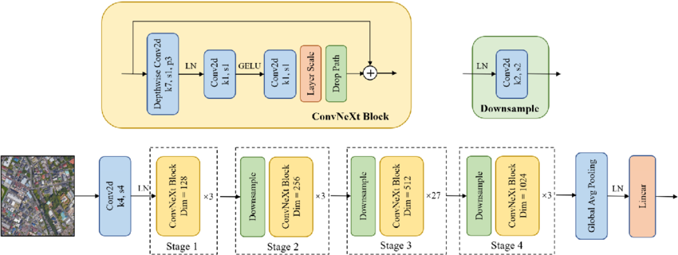
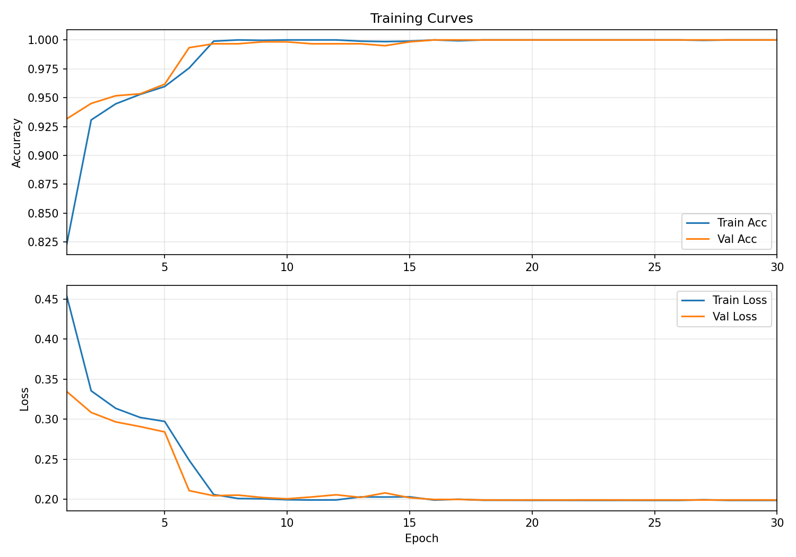
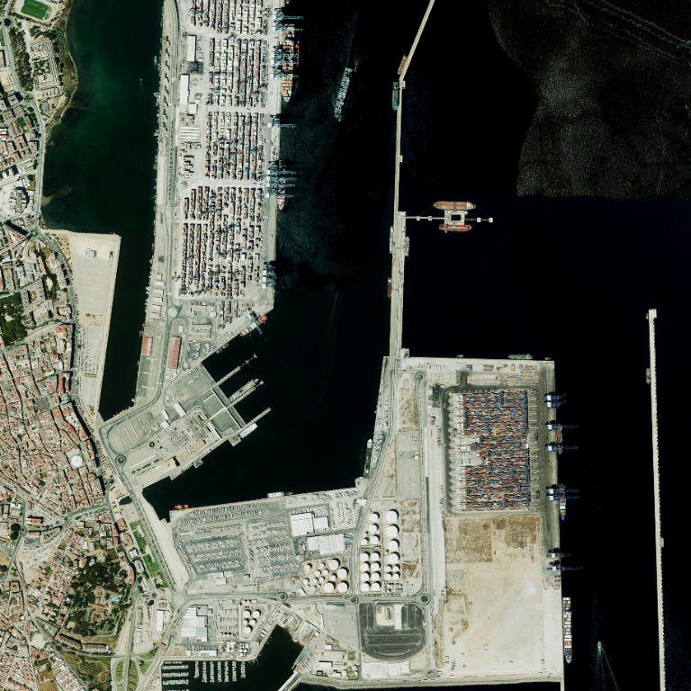
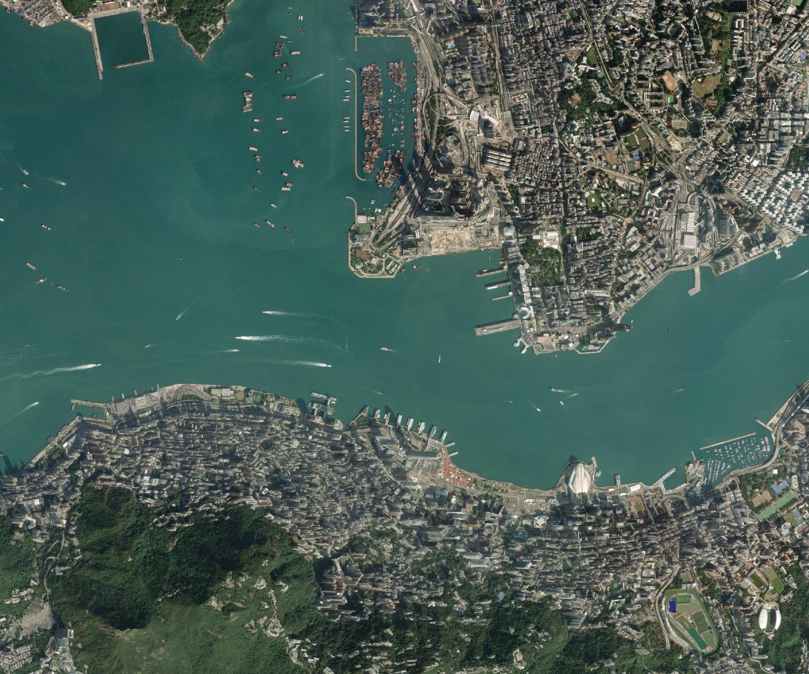
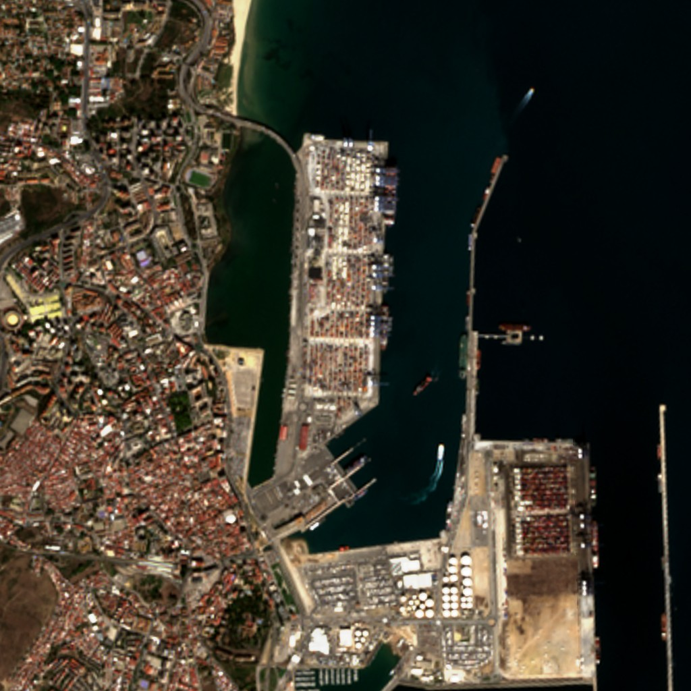
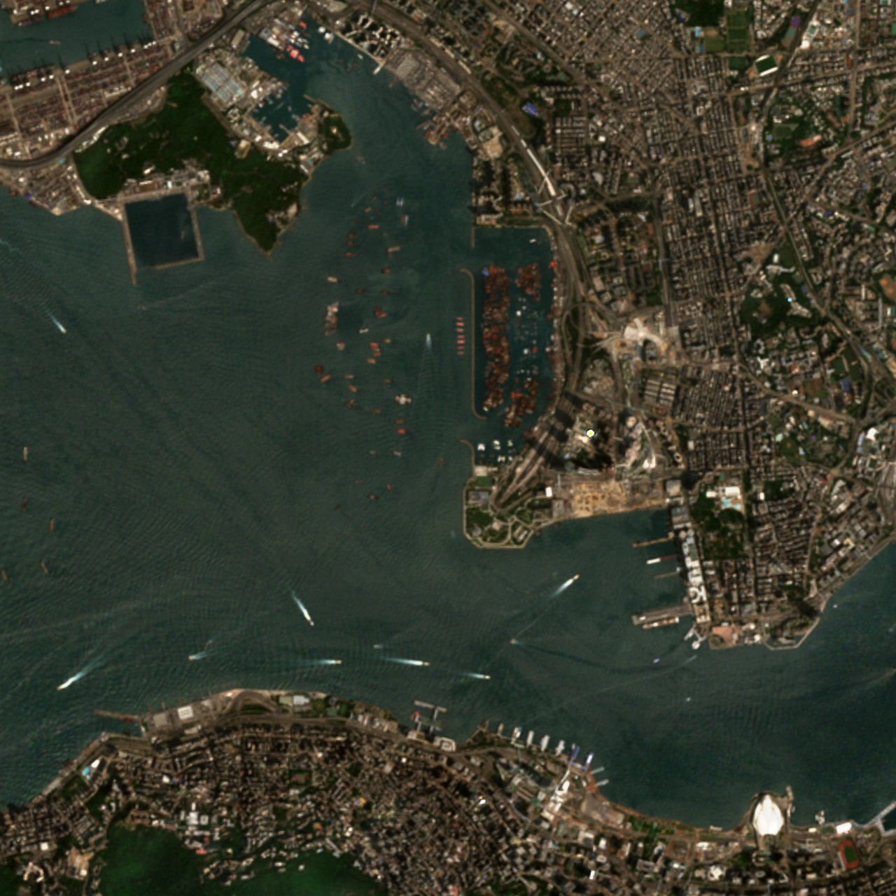
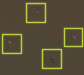
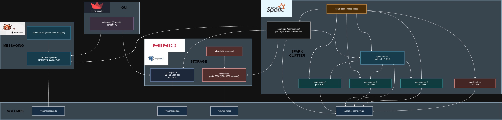

# 🛰️ AOI Downloader & Ship Detection — Real-ESRGAN ×4 + ConvNeXt

An interactive **Streamlit GUI** for selecting an **Area of Interest (AOI)** on a world map, downloading high-resolution map tiles, optionally **upscaling with Real-ESRGAN ×4**, and performing **ship detection** using a **ConvNeXt** model.  
Designed for convenient visual analysis.

---

## 📑 Table of Contents
1. [Overview](#-overview)
2. [Features](#-features)
3. [Repository Structure](#-repository-structure)
4. [Installation](#-installation)
5. [Usage](#-usage)
6. [Model Details](#-model-details)
7. [ConvNeXt Architecture](#-convnext-architecture)
8. [Model Training](#-model-training)
9. [Real-ESRGAN Integration](#-real-esrgan-integration)
10. [Raw vs. RealESRGAN](#-raw-vs-realesrgan)
11. [Results](#-results)
12. [Output Directories](#-output-directories)
13. [Going Lower Than Zoom 14 on Sentinel-2](#️-going-lower-than-zoom-14-on-sentinel-2)
14. [Spark Integration](#-spark-integration)

---

## 🚀 Overview

This application lets you:

1. Draw an AOI directly on a map (EOX Sentinel-2, Esri, or OSM).  
2. Download and stitch XYZ tiles into a single image.  
3. Optionally run **Real-ESRGAN ×4** super-resolution.  
4. Run **ConvNeXt-based ship detection** on either the RAW or UPSCALED image.  
5. Display both images side-by-side and download the results.

The UI is compact:  
**Left:** interactive map  
**Right:** progress panel  
**Below:** side-by-side input and detection images (no scrolling needed)

---

## ✨ Features

- 🗺️ Draw AOIs directly on interactive map layers  
- 🧩 Automatic tile download and stitching  
- 🔼 Optional Real-ESRGAN ×4 super-resolution  
- 🚢 ConvNeXt-based ship detection  
- ⚙️ Adjustable stride and probability threshold  

---

## 📁 Repository Structure

```
repo_root/
├── application/
│   ├── gui_app.py                 # Main Streamlit GUI entrypoint
│   ├── ConvNextInference.py       # Ship detection logic (detect_and_draw)
│   ├── providers.py               # Map tile providers (EOX, Esri, OSM)
│   ├── tiling.py                  # AOIRequest, TileStitcher, save_output_image
│   └── RRDBNet.py                 # Real-ESRGAN (RRDBNet) wrapper
│
├── training/
│   ├── convnext_train.py          # Training script
│   ├── convnext_base_config.json  # Training config (dataset path, epochs, etc.)
│   ├── training_curves.png        # Accuracy/Loss curves (moved here)
│   └── pretrained/
│       ├── ConvNext/
│       │   ├── convnext_ships.pt          # Trained ConvNeXt checkpoint
│       │   └── metrics.json               # Training metrics (accuracy/loss)
│       │
│       └── RealESRGAN/
│           └── RealESRGAN_x4plus.pth      # Pretrained Real-ESRGAN weights
│
├── scripts/
│   ├── create_venv.sh             # Linux/macOS venv setup
│   └── create_venv.bat            # Windows venv setup
│
├── downloads/                     # Runtime output (raw/upscaled)
├── results/                       # Detection overlays (raw/upscaled)
└── README.md
```

---

## 🧩 Installation

> Requires **Python 3.12+** and an internet connection for wheel downloads.

**Windows (Cmd):**
```
scripts/create_venv.bat
call venv\Scripts\activate.bat
```

**Linux / macOS (Bash):**
```
chmod +x scripts/create_venv.sh
./scripts/create_venv.sh
source venv/bin/activate
```

By default this installs:
- PyTorch 2.7.0 + CUDA 12.8 (auto-fallback to CPU wheels)
- Streamlit / Folium / Real-ESRGAN / OpenCV / TQDM / Matplotlib

| Variable | Default | Description |
|-----------|----------|-------------|
| `CUDA_WHL_TAG` | `cu128` | PyTorch CUDA wheel tag |
| `PYTORCH_VER` | `2.7.0` | PyTorch version |
| `VENV_DIR` | `venv` | Virtual environment folder |

---

## ▶️ Usage

Run the Streamlit app from the repo root:

```
invoke extract
invoke gui
```

Run `invoke extract` to extract model weights and dataset.

### Workflow
1. Draw a rectangular AOI on the map.  
2. In the sidebar:
   - Choose tile provider and zoom.  
   - Toggle **RealESRGAN** if you want ×4 super-resolution.  
   - Set detection stride and threshold.  
3. Click **Download → (Optional) Upscale → Detect**.  
4. Observe:
   - **Left image:** model input (RAW or UPSCALED)  
   - **Right image:** detection overlay  

### Recommended Zoom Levels ESRI
- **With RealESRGAN enabled:** set **zoom = 15** (recommended).  
- **Without RealESRGAN enabled:** set **zoom = 17** (recommended).

---

## 🧠 Model Details

- **Architecture:** ConvNeXt Base (binary classifier: ship / no-ship)  
- **Checkpoint:** `training/pretrained/ConvNext/convnext_ships.pt`  
- **Inference:** Sliding-window detection with adjustable stride and probability threshold  
- **Output:** Number of detected ships and overlay image saved to `results/`

---

## 🧩 ConvNeXt Architecture

ConvNeXt is a modernized convolutional neural network that re-imagines ResNet through the design lens of Vision Transformers (ViTs).  
Key features:

- **Stage-based hierarchical design** (similar to ResNet-50/101).  
- **Large kernel depthwise convolutions (7×7)** for better spatial capture.  
- **LayerNorm** normalization instead of BatchNorm for stability on GPUs.  
- **Inverted bottlenecks** and higher-dimensional expansions inspired by MobileNet V2.  
- **Simplified training pipeline** using standard data augmentations and cosine learning rate decay.

In this project, the **ConvNeXt-Base** variant (≈89 M parameters, pretrained on ImageNet-1K) is fine-tuned for **binary classification (ship vs no-ship)**.  
The original classifier layer is replaced with a new `Linear(in_features, 2)` head.

<p align="center">
  
</p>

---

## 🧬 Model Training

The ConvNeXt ship classifier was trained using the script `training/convnext_train.py`.

**Dataset:**  
The network was trained on the *Ships in Satellite Imagery* dataset (`shipsnet`), located under  
`dataset/ships_in_satellite_imagery/shipsnet/shipsnet`.  
Each image file is labeled directly in its filename prefix (`0__...png` for no-ship, `1__...png` for ship).

**Data Processing and Augmentation**
- Images are resized to **224×224 px** using bicubic interpolation.  
- Augmentations include horizontal flips, color jitter (brightness, contrast, saturation), and random erasing (`p=0.25`).  
- Inputs are normalized using ImageNet mean & std statistics.

**Training Configuration**
- 70 % training, 15 % validation, 15 % testing split.  
- Base learning rate `3e-4`, weight decay `1e-4`, optimizer: **AdamW**.  
- Loss function: **Cross-Entropy with label smoothing 0.1**.  
- Scheduler: **Cosine Annealing LR**.  
- **Warm-up training**: the classifier head is trained for 5 epochs with the backbone frozen, after which all layers are unfrozen and trained jointly.  
- Mixed precision (FP16 AMP) on CUDA for faster and more memory-efficient training.  
- Total 30 epochs, batch size 32, seed 42.

**Results and Outputs**
- The model achieving the highest validation accuracy is saved as:  
  `training/pretrained/ConvNext/convnext_ships.pt`
- Metrics (accuracy/loss per epoch) are stored in:  
  `training/pretrained/ConvNext/metrics.json`
- A plot of training curves (`training/training_curves.png`) shows convergence of loss and accuracy across train/val splits.

<p align="center">
  
</p>

---

## 🔼 Real-ESRGAN Integration

- Backbone: **RRDBNet (Residual-in-Residual Dense Blocks)**  
- Used when upscaling is selected (once or twice).  
- Saves to `downloads/upscaled/` and runs detection on the final upscaled image.  
- **Checkpoint:** `training/pretrained/RealESRGAN/RealESRGAN_x4plus.pth`  
- CUDA if available; CPU fallback otherwise.

---

## 🧭 Raw vs. RealESRGAN

The ConvNeXt network used for inference expects an input tensor of **224×224×3 (RGB)**.  
Thus, the visible size of ships inside this crop directly affects the network’s ability to extract meaningful spatial features.

### 📉 Raw (Low-Resolution) Input
- **Advantages:**
  - Requires less satellite bandwidth and download time.
  - Covers larger geographic areas per tile.
  - Efficient for wide-area scanning or coarse monitoring.
- **Disadvantages:**
  - Ships may occupy only a few pixels → low feature quality.
  - Small vessels often go undetected due to lack of texture.
  - Increased confusion with background noise (e.g., waves, docks).

### 🔼 Real-ESRGAN Upscaled Input
- **Advantages:**
  - Artificially enhances fine edges and visual detail.
  - Enables ConvNeXt to detect smaller ships that would be invisible in RAW input.
  - Useful when only coarse-zoom tiles (e.g., z14–z16) are available.
- **Disadvantages:**
  - Introduces **GAN artifacts** that may not correspond to real-world structures.
  - Artifacts can mislead the model, producing false positives.
  - Adds 4× computational cost and slower inference.
  - Does not truly increase resolution — it “hallucinates” plausible detail.

### ⚖️ Practical Trade-Off
- **Real-ESRGAN** is ideal when high-zoom satellite tiles are unavailable or bandwidth-limited.  
- However, **true high-resolution imagery** always yields better physical accuracy and fewer false detections.  
- In essence: *Real-ESRGAN enhances perceptual clarity but trades physical fidelity for visual quality.*

---

## 🖼️ Results — ESRI

### ⚓ Detection on RAW (Port of Shanghai)

**Input Image:**  


**Detections:**  


---

### 🌊 Detection with Real-ESRGAN (Ports: Algeciras, Spain & Victoria Harbour, Hong Kong)

Comparison between RAW, UPSCALED (×4), and DETECTION results.

<div align="center">

| Raw Image | Upscaled ×4 | Detections on Upscaled |
|---|---|---|
|  |  |  |
|  |  |  |

</div>

---

## 🖼️ Results — Sentinel-2

### ⚓ Detection on RAW (Port of Shanghai)

**Input Image:**  


**Detections:**  


---

### 🌊 Detection with Real-ESRGAN (Ports: Algeciras, Spain & Victoria Harbour, Hong Kong)

<div align="center">

| Raw Image | Upscaled ×4 | Detections on Upscaled |
|---|---|---|
|  |  |  |
|  |  |  |

</div>

---

## 🛰️ Going Lower Than Zoom 14 on Sentinel-2

When using Sentinel‑2 imagery below **zoom level 14**, the captured details become extremely coarse.  
At such low resolutions, the visual information content is drastically reduced — each ship often occupies only a few pixels, making it nearly indistinguishable from background noise such as sea texture or sunlight reflections.

As a result, **Real‑ESRGAN upscaling** cannot reconstruct meaningful detail from such sparse input — there simply isn’t enough signal for the model to “hallucinate” realistic structure.  
Consequently, **ConvNeXt** also fails to recognize ships reliably, since the features it depends on (edges, textures, object shape) are not discernible at this scale.

The image below demonstrates this limitation — **four ships** are visible in the open sea at **Sentinel‑2 zoom level 13**, yet the raw pixels lack sufficient clarity for confident detection:

<p align="center">
  
</p>

---

## 📂 Output Directories

| Path | Contents |
|---|---|
| `downloads/raw/` | Stitched AOIs |
| `downloads/upscaled/` | ×4 AOIs |
| `results/raw/` | Detection overlays (RAW) |
| `results/upscaled/` | Detection overlays (UPSCALED) |

---

## ⚙️ Spark Integration

The project includes a **fully containerized distributed processing system** for large-scale AOI processing using **Apache Spark**, **Redpanda (Kafka)**, **PostgreSQL**, and **MinIO**.

### 🏗️ Building Docker Images

```bash
docker build -t spark-spark-app ./app
docker-compose up -d --build
```

This builds the Spark base image (with Real-ESRGAN and ConvNeXt code) and launches all supporting containers.

### 🌐 Accessing Services

| Service | URL | Description |
|----------|-----|-------------|
| **Streamlit (aoi-submit)** | http://localhost:8501 | Submit AOIs, view job statuses, preview detection images |
| **Spark Master UI** | http://localhost:8080 | Spark job overview |
| **Spark History Server** | http://localhost:18080 | Completed job logs |
| **Spark Worker 1** | http://localhost:8080 | Spark worker 1|
| **Spark Worker 2** | http://localhost:8080 | Spark worker 2 |
| **Spark Worker 3** | http://localhost:8080 | Spark worker 3 |
| **Redpanda Console** | http://localhost:9644 | Kafka (topic: `aoi_jobs`) |
| **MinIO Console** | http://localhost:9001 | Object storage browser (bucket: `aoi`) |
| **Postgres** | https://localhost:5432 | Metadata and result tables |

---

### 🧱 System Architecture

Below is the architecture diagram showing all containers and their interactions:



Each component corresponds to the following functional group:

- **UI Layer:** `aoi-submit` Streamlit frontend for AOI job submission.  
- **Messaging Layer:** `redpanda` (Kafka) handles AOI job queues (`aoi_jobs`).  
- **Storage Layer:** `postgres` for metadata and results; `minio` for images.  
- **Processing Layer:** `spark-master`, `spark-workers`, and `spark-app` perform Real-ESRGAN upscaling and ConvNeXt inference in parallel.  
- **Monitoring Layer:** `spark-history` collects execution logs.  

---

### 🧩 Component Overview

- **Streamlit UI (8501):** User interface for submitting AOI jobs and visualizing results.  
- **Redpanda (9092):** Kafka-compatible message broker for job distribution.  
- **PostgreSQL (5432):** Stores AOI job metadata, status, and results.  
- **MinIO (9000/9001):** Stores raw, upscaled, and detection images.  
- **Spark Master (7077/8080):** Cluster control and web UI.  
- **Spark Workers (8081–8083):** Run distributed Python tasks (Real-ESRGAN + ConvNeXt).  
- **Spark App:** Python streaming job consuming from Redpanda and writing to Postgres/MinIO.  
- **Spark History (18080):** Job timeline viewer with event logs.

---

### ⚙️ Deployment Flow

1. The Streamlit app sends job JSONs to Redpanda topic `aoi_jobs`.  
2. Spark Structured Streaming reads messages in batches, distributes processing to workers.  
3. Each worker downloads tiles, optionally upscales via Real-ESRGAN, runs ConvNeXt detection.  
4. Results (images and metadata) are written to Postgres/MinIO.  
5. The Streamlit UI periodically queries the DB to display progress and outputs.

---

This setup transforms the single-machine AOI downloader into a **scalable distributed system** capable of processing multiple AOIs concurrently.
